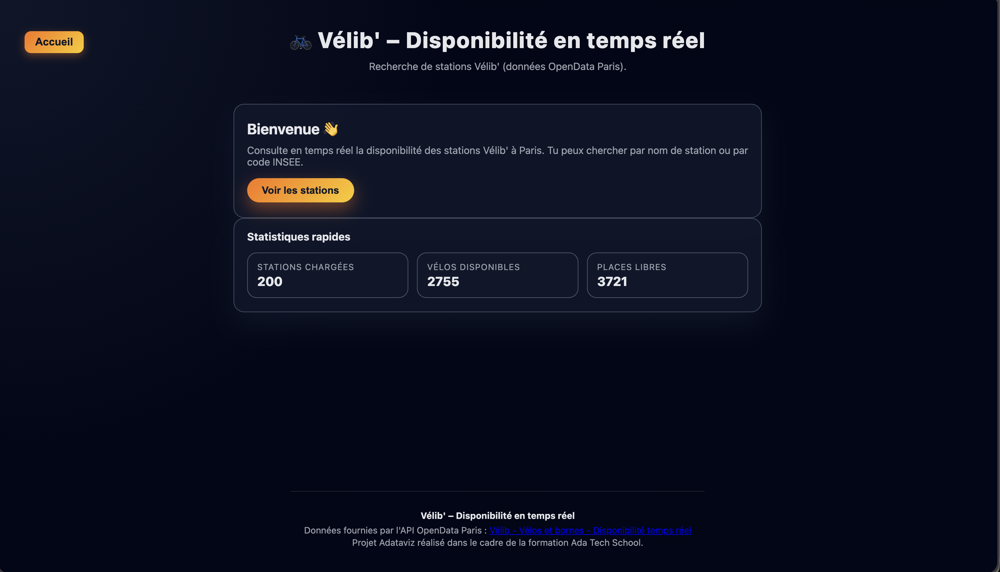
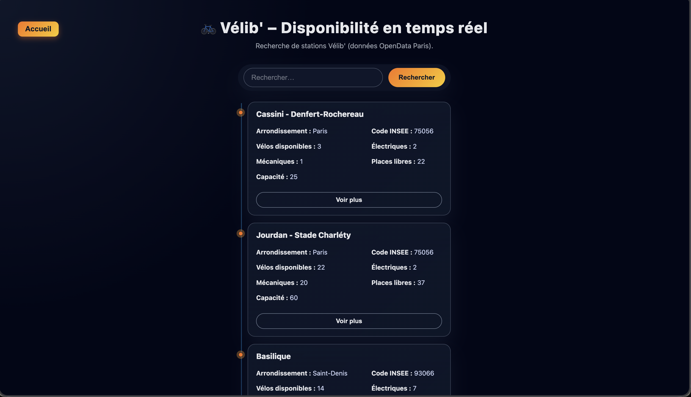

# 🚲 Adataviz – Dashboard Vélib' Paris

**Adataviz** est une application web interactive permettant de consulter en temps réel la disponibilité des stations Vélib' à Paris et en petite couronne. Ce projet utilise l'API OpenData de la Ville de Paris pour afficher les informations de manière claire et détaillée.

## Fonctionnalités

- **Disponibilité en temps réel** : Consultez le nombre de vélos (mécaniques et électriques) et de bornes disponibles pour chaque station.
- **Recherche intuitive** : Filtrez les stations par nom ou par code INSEE/arrondissement.
- **Détails complets** :
  - Nombre de vélos disponibles (total, électriques, mécaniques).
  - Nombre de places libres (bornettes).
  - Localisation sur une mini-carte (OpenStreetMap).
  - Date de dernière mise à jour des données.
- **Statistiques globales** : Un tableau de bord sur la page d'accueil affiche le nombre total de stations chargées, de vélos et de places disponibles.
- **Design Responsive** : L'interface s'adapte parfaitement aux mobiles, tablettes et ordinateurs (thème sombre moderne).

## Stack Technique

Ce projet a été réalisé avec des technologies web standard, sans framework, pour garantir légèreté et performance :

- **JavaScript (Vanilla JS)** : Logique de l'application, gestion de l'API et manipulation du DOM.
- **CSS 3** : Styles personnalisés, Flexbox, Grid, et animations CSS (pas de framework CSS).
- **HTML 5** : Structure sémantique de la page.
- **Vite** : Outil de build et serveur de développement rapide.
- **API** : [OpenData Paris - Vélib' Disponibilité temps réel](https://opendata.paris.fr/explore/dataset/velib-disponibilite-en-temps-reel/information/).
